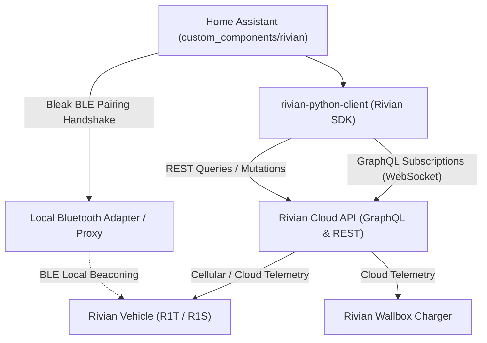
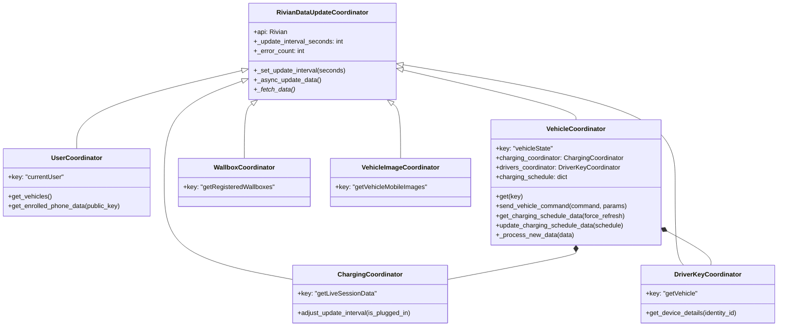
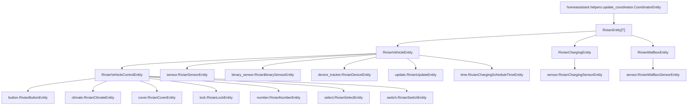
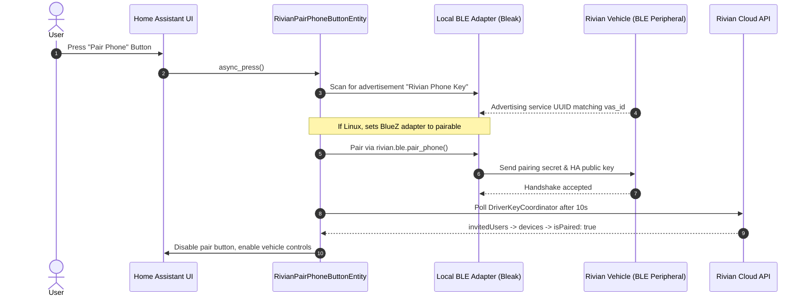

# CODEBASE.md: Rivian Home Assistant Integration Architecture & Developer Guide

This document is the authoritative, comprehensive architectural and codebase reference for `home-assistant-rivian`. It is designed for LLMs and human developers to rapidly understand system topology, file locations, data pipelines, security models, entity schemas, and debugging workflows.

---

## 1. System Overview & Ecosystem

### Purpose
An unofficial Home Assistant custom component integration (`custom_components/rivian`) providing monitoring, telemetry tracking, remote commands, charging scheduling, and wallbox management for Rivian electric vehicles (R1T, R1S) and Rivian Wallbox chargers.

### Integration Identity
- **Integration Domain**: `rivian`
- **Integration Type**: Hub (`"integration_type": "hub"`)
- **IoT Class**: `cloud_polling` (Note: telemetry actually utilizes persistent cloud WebSocket subscriptions; charging sessions, keys, and wallboxes poll REST APIs)
- **Primary Upstream Client**: `rivian-python-client[ble]==2.0.0`
- **Dependencies**: `bluetooth_adapters` (for BLE phone pairing)
- **Loggers**: `custom_components.rivian`, `rivian`

### Vehicle Communication & API Topology


1. **Telemetry Ingestion (WebSocket)**: Vehicle state is streamed in real time via Rivian's GraphQL WebSocket subscription (`subscribe_for_vehicle_updates`). Direct REST polling of vehicle telemetry is obsolete and explicitly disabled (`NotImplementedError`).
2. **REST Querying (Coordinators)**: User metadata, vehicle lists, driver/key provisioning, live charging session metrics, and wallbox status are queried via REST GraphQL endpoints.
3. **REST Mutations (Vehicle Commands)**: Remote commands (locks, climate, frunk, windows, seat heat) are dispatched to the Rivian cloud command API signed with a cryptographic private key generated during phone enrollment.
4. **Bluetooth Low Energy (BLE)**: Used exclusively during the one-time phone key pairing process (`button.pair`). HA emulates a phone key via `bleak` and `rivian.ble` to obtain vehicle approval for remote controls.

### Authentication & Token Lifecycle
Stored in `ConfigEntry.data`:
- `access_token`: Short-lived bearer token for GraphQL/REST requests.
- `refresh_token`: Token used to refresh access tokens.
- `user_session_token`: Session token for account management.
- `username`: Account email.

Stored in `ConfigEntry.options`:
- `public_key`: P-256 ECC public key generated by HA for phone key enrollment.
- `private_key`: P-256 ECC private key used to sign vehicle control commands.
- `vehicle_control`: List of vehicle device IDs authorized for remote control.
- `zone`: Optional list of Home Assistant `zone` entity IDs restricting remote commands to specific geographic regions.
- `vehicle_image_style`: `"cel"` (3D cel-shaded), `"photo"` (photorealistic), or `"none"`.

Token refreshes happen automatically inside `RivianDataUpdateCoordinator._async_update_data()` when catching `RivianExpiredTokenError` by executing `await self.api.create_csrf_token()`.

---

## 2. Directory & File Map

### Repository Root Files
| File | Responsibility |
| :--- | :--- |
| [`manifest.json`](file:///C:/Users/Nate%20Admin%20Local/bin/development/home-assistant-rivian/custom_components/rivian/manifest.json) | Integration metadata, domain, requirements (`rivian-python-client[ble]==2.0.0`), after-dependencies (`bluetooth_adapters`), loggers. |
| [`pyproject.toml`](file:///C:/Users/Nate%20Admin%20Local/bin/development/home-assistant-rivian/pyproject.toml) | Linter config: `ruff >= 0.16.2`, isort rules, pylint rule suppressions (`abstract-method`, `unexpected-keyword-arg`, `broad-except`). |
| [`requirements.txt`](file:///C:/Users/Nate%20Admin%20Local/bin/development/home-assistant-rivian/requirements.txt) | Core runtime & development requirements (`homeassistant>=2025.1.0`, `rivian-python-client[ble]==2.0.0`, `ruff`, etc.). |
| [`hacs.json`](file:///C:/Users/Nate%20Admin%20Local/bin/development/home-assistant-rivian/hacs.json) | HACS packaging definition (`homeassistant: 2025.1.0`, render `README.md`). |
| [`old-sensors`](file:///C:/Users/Nate%20Admin%20Local/bin/development/home-assistant-rivian/old-sensors) | Reference file containing legacy / deprecated sensor definitions and field names. |

### Component Implementation (`custom_components/rivian/`)

| File | Purpose & Architectural Role | Key Classes / Functions / Constants |
| :--- | :--- | :--- |
| [`__init__.py`](file:///C:/Users/Nate%20Admin%20Local/bin/development/home-assistant-rivian/custom_components/rivian/__init__.py) | Setup entry point, lifecycle management, coordinator instantiation, platform forwarding, reload listener, device removal handler. | `async_setup_entry()`, `async_unload_entry()`, `async_remove_entry()`, `PLATFORMS` (13 platforms). |
| [`coordinator.py`](file:///C:/Users/Nate%20Admin%20Local/bin/development/home-assistant-rivian/custom_components/rivian/coordinator.py) | Data update coordinators managing WebSocket subscriptions, polling intervals, backoff, vehicle wake-up, invalid state caching, and charging schedules. | `RivianDataUpdateCoordinator`, `UserCoordinator`, `VehicleCoordinator`, `ChargingCoordinator`, `DriverKeyCoordinator`, `WallboxCoordinator`, `VehicleImageCoordinator`. |
| [`entity.py`](file:///C:/Users/Nate%20Admin%20Local/bin/development/home-assistant-rivian/custom_components/rivian/entity.py) | Base entity inheritance hierarchy enforcing unique ID generation, device info association, field availability, safety conditions, and geofencing. | `RivianEntity`, `RivianVehicleEntity`, `RivianVehicleControlEntity`, `RivianChargingEntity`, `RivianWallboxEntity`. |
| [`data_classes.py`](file:///C:/Users/Nate%20Admin%20Local/bin/development/home-assistant-rivian/custom_components/rivian/data_classes.py) | Extended dataclasses binding entity definitions to API fields, extraction lambdas, command callables, and availability hooks. | `RivianSensorEntityDescription`, `RivianBinarySensorEntityDescription`, `RivianButtonEntityDescription`, `RivianCoverEntityDescription`, `RivianLockEntityDescription`, `RivianNumberEntityDescription`, `RivianSelectEntityDescription`, `RivianSwitchEntityDescription`, `RivianTimeEntityDescription`, `RivianWallboxSensorEntityDescription`. |
| [`const.py`](file:///C:/Users/Nate%20Admin%20Local/bin/development/home-assistant-rivian/custom_components/rivian/const.py) | Over 1,100 lines defining sensor/binary sensor tuples by vehicle model, API field sets for subscriptions, default charging schedules, and invalid states. | `SENSORS`, `BINARY_SENSORS`, `VEHICLE_STATE_API_FIELDS`, `CHARGING_API_FIELDS`, `INVALID_SENSOR_STATES`, `DEFAULT_CHARGING_SCHEDULE`, `LOCK_STATE_ENTITIES`. |
| [`config_flow.py`](file:///C:/Users/Nate%20Admin%20Local/bin/development/home-assistant-rivian/custom_components/rivian/config_flow.py) | UI configuration flow, credential authentication, 2FA/OTP validation, reauth flow, and options flow (BLE key generation, phone enrollment/disenrollment, image styling, zones). | `RivianFlowHandler`, `validate_vehicle_control()`, `OPTIONS_FLOW`. |
| [`helpers.py`](file:///C:/Users/Nate%20Admin%20Local/bin/development/home-assistant-rivian/custom_components/rivian/helpers.py) | Helper utilities for extracting client sessions and redacting sensitive PII/tokens in logs and diagnostics. | `get_rivian_api_from_entry()`, `redact()`, `TO_REDACT`. |
| [`recorder.py`](file:///C:/Users/Nate%20Admin%20Local/bin/development/home-assistant-rivian/custom_components/rivian/recorder.py) | Database optimization: registers attribute exclusion to prevent storing high-frequency timestamps in `home-assistant_v2.db`. | `exclude_attributes()` (`{"last_update"}`). |
| [`diagnostics.py`](file:///C:/Users/Nate%20Admin%20Local/bin/development/home-assistant-rivian/custom_components/rivian/diagnostics.py) | HA diagnostics platform dump of all coordinator data with sensitive fields redacted. | `async_get_config_entry_diagnostics()`. |

### Platform Modules (`custom_components/rivian/`)

| Platform File | Entity Classes Defined | Descriptions / Constants | Key Features & Behavior |
| :--- | :--- | :--- | :--- |
| [`sensor.py`](file:///C:/Users/Nate%20Admin%20Local/bin/development/home-assistant-rivian/custom_components/rivian/sensor.py) | `RivianSensorEntity`, `RivianChargingSensorEntity`, `RivianDriverSensorEntity`, `RivianWallboxSensorEntity`, `RivianChargingScheduleDaysEntity` | `SENSORS`, `CHARGING_SENSORS`, `DRIVER_SENSORS`, `WALLBOX_SENSORS`, `CHARGING_SCHEDULE_DAYS_SENSOR` | Vehicle sensors, charging telemetry (cost, kWh, speed, range added), driver/key metrics, wallbox metrics, human-readable charging days summary (`"daily"`, `"weekdays"`, or list). |
| [`binary_sensor.py`](file:///C:/Users/Nate%20Admin%20Local/bin/development/home-assistant-rivian/custom_components/rivian/binary_sensor.py) | `RivianBinarySensorEntity` | `BINARY_SENSORS` | Doors, closures, seats, charging connection, gear guard alarm. Supports set-based multi-field aggregate evaluation. |
| [`button.py`](file:///C:/Users/Nate%20Admin%20Local/bin/development/home-assistant-rivian/custom_components/rivian/button.py) | `RivianButtonEntity`, `RivianPairPhoneButtonEntity` | `BUTTONS` | Wake vehicle, open gear tunnel left/right, drop tailgate, and active BLE phone pairing with Linux BlueZ pairable support. |
| [`climate.py`](file:///C:/Users/Nate%20Admin%20Local/bin/development/home-assistant-rivian/custom_components/rivian/climate.py) | `RivianClimateEntity` | `CLIMATE`, `DEFROST_DEFOG` | Cabin preconditioning, HVAC mode (Off, Heat/Cool, Heat), driver set temperature (16–29°C), presets (`"LO"`, `"HI"`, `"Defrost/Defog"`). |
| [`cover.py`](file:///C:/Users/Nate%20Admin%20Local/bin/development/home-assistant-rivian/custom_components/rivian/cover.py) | `RivianCoverEntity` | `COVERS`, `WINDOWS` | Frunk open/close, all windows vent/close, charge port door, R1S liftgate, R1T tonneau cover. |
| [`device_tracker.py`](file:///C:/Users/Nate%20Admin%20Local/bin/development/home-assistant-rivian/custom_components/rivian/device_tracker.py) | `RivianDeviceEntity` | `LOCATION_DESCRIPTION` | GPS vehicle location based on `gnssLocation` coordinates. |
| [`image.py`](file:///C:/Users/Nate%20Admin%20Local/bin/development/home-assistant-rivian/custom_components/rivian/image.py) | `RivianVehicleImageEntity` | — | Vehicle rendering images fetched via API (supports `"cel"` 3D style or `"photo"` style). |
| [`lock.py`](file:///C:/Users/Nate%20Admin%20Local/bin/development/home-assistant-rivian/custom_components/rivian/lock.py) | `RivianLockEntity` | `LOCKS`, `LOCK_STATE_ENTITIES` | Vehicle closures lock/unlock. Aggregates all door, frunk, liftgate, tailgate, and gear tunnel lock statuses. |
| [`number.py`](file:///C:/Users/Nate%20Admin%20Local/bin/development/home-assistant-rivian/custom_components/rivian/number.py) | `RivianNumberEntity`, `RivianChargingScheduleAmperageEntity` | `NUMBERS`, `CHARGING_SCHEDULE_AMPERAGE_NUMBER` | Battery charge limit percentage (50–100%), Charging schedule amperage slider (8–48A, step 2A). |
| [`select.py`](file:///C:/Users/Nate%20Admin%20Local/bin/development/home-assistant-rivian/custom_components/rivian/select.py) | `RivianSelectEntity` | `SELECTS`, `LEVELS`, `LEVEL_MAP` | Heated and ventilated seat levels (`Off`, `Level_1`, `Level_2`, `Level_3`) for front and rear seats. |
| [`switch.py`](file:///C:/Users/Nate%20Admin%20Local/bin/development/home-assistant-rivian/custom_components/rivian/switch.py) | `RivianSwitchEntity`, `RivianChargingScheduleEnabledEntity` | `SWITCHES`, `CHARGING_SCHEDULE_ENABLED_SWITCH` | Panic alarm on/off, remote charging start/stop, Gear Guard video on/off, steering wheel heat, charging schedule enabled toggle. |
| [`time.py`](file:///C:/Users/Nate%20Admin%20Local/bin/development/home-assistant-rivian/custom_components/rivian/time.py) | `RivianChargingScheduleTimeEntity` | `TIME_ENTITIES` | Charging schedule start time and end time entities (minutes-from-midnight conversion). |
| [`update.py`](file:///C:/Users/Nate%20Admin%20Local/bin/development/home-assistant-rivian/custom_components/rivian/update.py) | `RivianUpdateEntity` | `UPDATE_DESCRIPTION`, `INSTALLING_STATUS`, `READY_FOR_INSTALL` | OTA firmware updates, installed vs available version with Git hash formatting, install progress percentage, install trigger, and release notes link. |

---

## 3. Data Coordinators & Telemetry Pipeline

All coordinators extend `RivianDataUpdateCoordinator` (which extends HA's `DataUpdateCoordinator`).



### Coordinator Details

#### 1. `RivianDataUpdateCoordinator` (Base)
- Handles exponential backoff when errors occur (`min(_update_interval_seconds * 2**self._error_count, 900)`).
- Intercepts `RivianExpiredTokenError`, refreshes tokens via `create_csrf_token()`, and transparently retries.
- Intercepts `RivianUnauthenticated` and triggers `ConfigEntryAuthFailed`.
- Automatically redacts logged payloads using `helpers.redact()`.

#### 2. `UserCoordinator`
- **Endpoint**: `currentUser`.
- **Purpose**: Runs first during `async_setup_entry`. Retrieves the list of vehicles associated with the account, user ID, and registered phone identities (`enrolledPhones`).
- **Key Methods**:
  - `get_vehicles()`: Parses models, names, VAS (Vehicle Access Security) IDs, and public keys.
  - `get_enrolled_phone_data(public_key)`: Finds phone ID and mapped identity IDs matching HA's public key.

#### 3. `VehicleCoordinator` (Core Telemetry Hub)
- **Endpoint**: `vehicleState` via **WebSocket Subscription** (`subscribe_for_vehicle_updates`).
- **Polling Prohibited**: `_fetch_data()` raises `NotImplementedError` because polling vehicle state causes API rate limits and battery drain.
- **Subscription Lifecycle**:
  - Initiates subscription in `_async_update_data()` with fields defined in `const.VEHICLE_STATE_API_FIELDS`.
  - Waits up to `INITIAL_UPDATE_TIMEOUT = 60` seconds for the initial payload.
  - On shutdown or reload, cleanly awaits `_unsubscribe()`.
- **Telemetry Processing (`_process_new_data`)**:
  - Merges new incoming telemetry dictionaries with existing state (`prev_items | items`).
  - **Invalid Sensor Filtering**: If an incoming sensor value is in `INVALID_SENSOR_STATES` (`{"fault", "signal_not_available", "undefined"}`), the coordinator discards the fault and retains the previous valid value. (Rivian's vehicle bus commonly reports temporary signal faults when modules sleep).
  - Maintains `history` sets of values for each key.
  - Monitors `powerState`: if `"sleep"`, clears `_awake` event; otherwise sets `_awake`.
  - Monitors `chargerStatus`: calls `charging_coordinator.adjust_update_interval(is_plugged_in)`.
- **Vehicle Command Dispatcher**:
  - `send_vehicle_command(command, params)`: Checks if vehicle is in `"sleep"`. If so, dispatches `VehicleCommand.WAKE_VEHICLE` first and waits up to 30 seconds before sending the intended command.

#### 4. `ChargingCoordinator`
- **Endpoint**: `getLiveSessionData`.
- **Adaptive Polling**:
  - When disconnected (`chrgr_sts_not_connected`): polls every **15 minutes**.
  - When plugged in: shifts to **30 seconds** for live charging monitoring.

#### 5. `DriverKeyCoordinator`
- **Endpoint**: `getVehicle(vehicle_id)`.
- **Interval**: 15 minutes.
- **Purpose**: Tracks `invitedUsers`, provisioned key fobs, key cards, and phone keys. Extracts `isPaired` and `isEnabled` status for the Home Assistant phone identity.

#### 6. `WallboxCoordinator`
- **Endpoint**: `getRegisteredWallboxes`.
- **Interval**: Default coordinator interval (30s).
- **Purpose**: Discovers and monitors wallbox charging power, current, voltage, and plug status.

#### 7. `VehicleImageCoordinator`
- **Endpoint**: `getVehicleMobileImages`.
- **Interval**: 0 (disabled polling; on-demand refresh).
- **Purpose**: Fetches 3D cel-shaded or photorealistic vehicle renders matching the vehicle's paint, wheel, and trim configuration.

---

## 4. Entity Architecture & Platform Map

### Entity Class Hierarchy


### Base Entity Behaviors

#### `RivianEntity[T]`
- Inherits `CoordinatorEntity[T]`.
- Enables `_attr_has_entity_name = True`.

#### `RivianVehicleEntity`
- Extends `RivianEntity[VehicleCoordinator]`.
- Binds to vehicle device in HA Device Registry with identifiers `{(DOMAIN, vin), (DOMAIN, vehicle_id)}`.
- Formats unique ID: `f"{vin}-{description.key}"`.
- Availability rule: If `entity_description.field` is specified and coordinator returns `None`, entity reports unavailable.

#### `RivianVehicleControlEntity`
- Extends `RivianVehicleEntity`.
- **Safety Gate 1**: Vehicle must be in Park (`coordinator.get("gearStatus") == "park"`).
- **Safety Gate 2**: Phone identity must be enrolled and paired (`device["isPaired"] == True`). Listens to `drivers_coordinator` updates.
- **Safety Gate 3**: Geofencing. If `CONF_ZONE` is configured in options, vehicle `gnssLocation` must fall inside one of the specified HA zones via `homeassistant.components.zone.in_zone()`.
- **Safety Gate 4**: Custom availability function on description (`description.available(coordinator)`).

#### `RivianChargingEntity`
- Extends `RivianEntity[ChargingCoordinator]`.
- Binds to the vehicle's device info via VIN.

#### `RivianWallboxEntity`
- Extends `RivianEntity[WallboxCoordinator]`.
- Binds to the wallbox device info with serial number, model, and software version.

---

## 5. Vehicle Control, Security & BLE Pairing

### Security & Pairing Model
To execute remote commands against a Rivian vehicle:
1. The Rivian account must have **Two-Factor Authentication (2FA)** enabled.
2. An asymmetric ECC P-256 keypair is generated during integration options flow.
3. The public key is enrolled with Rivian's cloud API as a "Phone Key" using device type `"HA"`.
4. The vehicle must undergo a **one-time BLE pairing handshake** inside or adjacent to the vehicle.



### Remote Command Dispatch Mechanics
When an entity (e.g. `climate`, `cover`, `lock`, `switch`) invokes a control:
1. Method calls `coordinator.send_vehicle_command(command, params)`.
2. If `coordinator.get("powerState") == "sleep"`, sends `VehicleCommand.WAKE_VEHICLE` and pauses for `_awake` event.
3. Obtains `phone_id`, `phone_identity_id`, `vas_id`, `vehicle_key`, and `private_key`.
4. Calls `api.send_vehicle_command(...)`.

---

## 6. Charging Schedule Architecture

Charging schedules are synchronized with Rivian cloud schedule structures.

### Data Model
```python
DEFAULT_CHARGING_SCHEDULE = {
    "startTime": 1320,  # Minutes from midnight (10:00 PM)
    "duration": 480,  # Duration in minutes (8 hours)
    "amperage": 48,  # Amps (8A - 48A, step 2)
    "enabled": True,  # Schedule enabled toggle
    "weekDays": [
        "Monday",
        "Tuesday",
        "Wednesday",
        "Thursday",
        "Friday",
        "Saturday",
        "Sunday",
    ],
}
```

### Platform Mapping
- [`time.py`](file:///C:/Users/Nate%20Admin%20Local/bin/development/home-assistant-rivian/custom_components/rivian/time.py):
  - `charging_schedule_start`: Converts `startTime` into Python `datetime.time`.
  - `charging_schedule_end`: Converts `(startTime + duration) % 1440` into Python `datetime.time`.
  - Adjusting end time recalculates `duration`. Adjusting start time preserves end time by recalculating `duration`.
- [`number.py`](file:///C:/Users/Nate%20Admin%20Local/bin/development/home-assistant-rivian/custom_components/rivian/number.py):
  - `charging_schedule_amperage`: Slider between 8A and 48A with step 2A.
- [`switch.py`](file:///C:/Users/Nate%20Admin%20Local/bin/development/home-assistant-rivian/custom_components/rivian/switch.py):
  - `charging_schedule_enabled`: Toggles `enabled` boolean in the schedule payload.
- [`sensor.py`](file:///C:/Users/Nate%20Admin%20Local/bin/development/home-assistant-rivian/custom_components/rivian/sensor.py):
  - `charging_schedule_days`: Formats days list as `"daily"`, `"weekdays"`, or comma-separated days.
- **Cooldown & Caching**:
  - `VehicleCoordinator.get_charging_schedule_data(force_refresh)` caches schedule data with a 15-minute refresh interval and a 10-second cool-off after mutations.

---

## 7. Developer & LLM Recipes (How-To Guides)

### Recipe 1: How to Add a New Vehicle Sensor
1. Check if the field is present in Rivian API telemetry. (Inspect diagnostics dump or `old-sensors`).
2. Add the sensor description to `const.py` inside `SENSORS["R1"]` (or `"R1S"` if SUV-specific):
   ```python
   (
       RivianSensorEntityDescription(
           key="my_sensor_key",
           field="apiFieldName",
           name="My Sensor Name",
           icon="mdi:gauge",
           device_class=SensorDeviceClass.POWER,
           native_unit_of_measurement=UnitOfPower.KILO_WATT,
           state_class=SensorStateClass.MEASUREMENT,
           suggested_display_precision=1,
           value_lambda=lambda v: round(v, 1) if v is not None else None,
       ),
   )
   ```
3. Ensure the field is included in `VEHICLE_STATE_API_FIELDS` in `const.py`:
   - It is automatically included if it is defined in `SENSORS`. If it has non-standard extraction, add it directly to `VEHICLE_STATE_API_FIELDS`.
4. If translation is needed, add keys to [`strings.json`](file:///C:/Users/Nate%20Admin%20Local/bin/development/home-assistant-rivian/custom_components/rivian/strings.json) and [`translations/en.json`](file:///C:/Users/Nate%20Admin%20Local/bin/development/home-assistant-rivian/custom_components/rivian/translations/en.json).

### Recipe 2: How to Add a New Binary Sensor
1. In `const.py`, add to `BINARY_SENSORS["R1"]`:
   ```python
   (
       RivianBinarySensorEntityDescription(
           key="my_binary_sensor",
           field="apiBooleanField",
           name="My Binary Sensor",
           device_class=BinarySensorDeviceClass.PROBLEM,
           on_value="fault",  # or list: ["fault", "warning"]
           negate=False,
       ),
   )
   ```
2. For multi-field aggregation (e.g. any door open):
   ```python
   (
       RivianBinarySensorEntityDescription(
           key="any_door_open",
           field={"doorFrontLeftClosed", "doorFrontRightClosed"},
           name="Any Door Open",
           device_class=BinarySensorDeviceClass.DOOR,
           on_value="open",
       ),
   )
   ```

### Recipe 3: How to Add a New Vehicle Control Action
1. Verify the action exists in `rivian.VehicleCommand` enum (upstream library).
2. Choose appropriate platform:
   - Instant action -> [`button.py`](file:///C:/Users/Nate%20Admin%20Local/bin/development/home-assistant-rivian/custom_components/rivian/button.py)
   - Continuous state toggle -> [`switch.py`](file:///C:/Users/Nate%20Admin%20Local/bin/development/home-assistant-rivian/custom_components/rivian/switch.py)
   - Slider -> [`number.py`](file:///C:/Users/Nate%20Admin%20Local/bin/development/home-assistant-rivian/custom_components/rivian/number.py)
   - Door/gate/latch -> [`cover.py`](file:///C:/Users/Nate%20Admin%20Local/bin/development/home-assistant-rivian/custom_components/rivian/cover.py)
3. Instantiate entity inheriting `RivianVehicleControlEntity`. Example button in `button.py`:
   ```python
   RivianButtonEntityDescription(
       key="honk_horn",
       name="Honk Horn",
       icon="mdi:bugle",
       press_fn=lambda coordinator: coordinator.send_vehicle_command(
           command=VehicleCommand.HONK_HORN
       ),
   )
   ```
4. If feature depends on vehicle capability, gate by `supported_features` in `BUTTONS` dictionary.

### Recipe 4: How to Test and Lint Code
Run these commands in PowerShell or devcontainer:
```powershell
# Lint check
ruff check custom_components/

# Format code
ruff format custom_components/
```

---

## 8. Gotchas, Anti-Patterns & Safety Rules

1. **NEVER Poll Vehicle Telemetry**:
   - `VehicleCoordinator` must never use HTTP polling. Telemetry arrives exclusively via WebSocket callbacks. Polling causes vehicle vampire battery drain and cloud rate limits.
2. **Handle `INVALID_SENSOR_STATES`**:
   - Rivian vehicle modules send `"signal_not_available"`, `"fault"`, or `"undefined"` when sleeping or power cycling. If writing custom sensor logic, NEVER let these replace valid values; use `_get_value()` which relies on the coordinator's filtered cache.
3. **Database Recorder Optimization**:
   - Do NOT add rapidly updating attributes (like raw timestamps or continuous telemetry diffs) to `extra_state_attributes` without registering them in `recorder.py:exclude_attributes()`. Otherwise, Home Assistant's SQLite database (`home-assistant_v2.db`) will experience severe write amplification.
4. **Safety & Remote Control Preconditions**:
   - Never bypass `RivianVehicleControlEntity` inheritance for control entities. The check for `gearStatus == "park"` is a safety-critical requirement.
5. **Timestamp Parsing**:
   - Rivian timestamps include microseconds and timezone offsets:
     `RIVIAN_TIMESTAMP_FORMAT = "%Y-%m-%dT%H:%M:%S.%f%z"`.
     Always convert to UTC when creating `TIMESTAMP` device class sensors.
6. **Model Distinctions (R1T vs R1S)**:
   - R1T has a powered tonneau cover and gear tunnel.
   - R1S has a powered liftgate and 3rd row seats.
   - Always filter model-specific sensors and controls via `vehicle["model"]` or `vehicle["supported_features"]`.
