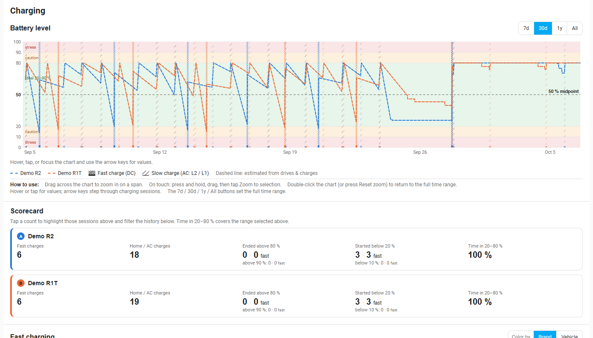
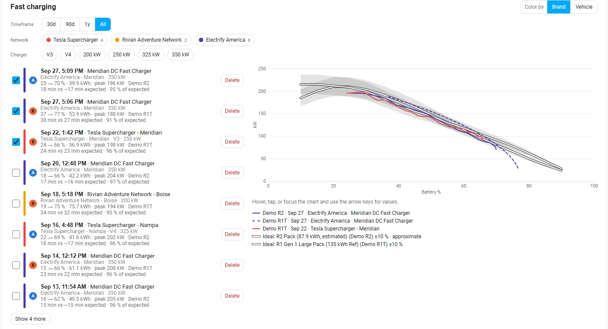
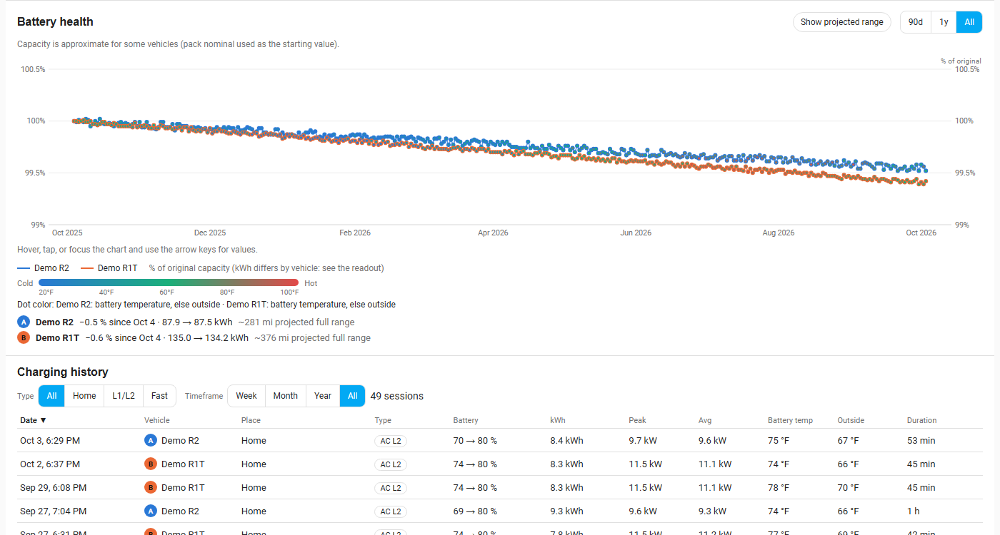
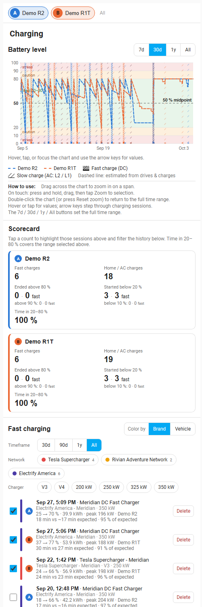

# Charging tab

The Charging tab covers your battery level over time, how well you charge, fast-charge performance, battery health and a full charging history. Home (AC) and fast (DC) sessions are both recorded, from the time the integration is installed or upgraded to 2.0.

## Battery level

One line per selected vehicle shows state of charge over time, with a range switch (**7d / 30d / 1y / All**). Shaded bands mark the zones: below 10 % and above 90 % are "stress", 10-20 % and 80-90 % are "caution", and **20-80 % is the ideal zone** for everyday battery life. A dashed line marks the 50 % midpoint. Charging sessions appear as spans: **dense hatching** for fast (DC) charging and **sparse /// hatching** for slow AC charging (Level 2 or Level 1), as the key under the chart shows. A span with a **dashed outline** is an **inferred** charge: the battery level rose but no session was recorded, for example home charges from before home charging was recorded, or a session that was missed (see [Inferred charges](#inferred-charges)). Such a charge ends where the level stops rising (a pause of 15 minutes, or an hour on views longer than 10 days, ends it). It counts as fast only when a drive ended within the hour before it, since a fast charge means driving to a charger. If Home Assistant stops getting updates from the car for a while (its live connection to Rivian stalls) while the car keeps charging, the level freezes and then jumps when updates resume; that stretch is shown as one slow charge whose end is estimated from its charging rate, and its tooltip says so. Inferred charges have a tooltip and appear in the scorecard and the history table, marked **Inferred**. A dashed line segment means the level was estimated from drives and charges because no live reading was available.

- **Hover** the chart for values at a point (or tap, or use the arrow keys when it has focus).
- **Zoom:** drag across the chart to select a span. On a touch screen, **press and hold, then drag**, then press **Zoom to selection**. **Reset zoom** (or a double-click on the chart) goes back out. The scorecard and lists below follow the zoom.

## Inferred charges

Home Assistant can miss a charge: the live connection to Rivian may stall, or the charge may predate the integration. The battery level the integration has recorded still shows the rise, so it is **inferred** into a charging session.

- Inferred sessions are **stored nightly**, and after install or an upgrade the integration does **one full back-scan** of the whole recorded battery-level history; after that it only re-checks recent days.
- They are labeled **Inferred** (dashed outline on the chart, dashed badge and muted row in the history). Their rate is unknown, so they are shown as slow AC charges unless a drive ended just before and the rise was fast.
- A real session always wins: if a recorded session covers the same time, nothing is inferred there. Deleting an inferred session (administrators) keeps it deleted.
- Demo vehicles have no battery-level history to scan, so none are inferred.

## Scorecard

One card per vehicle, counted over the selected range:

- **Fast charges** and **Home / AC charges**;
- **Ended above 80 %** (with the number above 90 % beneath);
- **Started below 20 %** (with the number below 10 % beneath);
- **Time in 20-80 %**, the share of time the battery spent in the ideal zone.

Each count that has a "fast" companion is split into all sessions and fast-only. **Tap a count** to highlight those sessions and filter the history table; clear it with the **x** in the history header.

## Fast charging

Every DC fast-charge session with its charging curve (power against battery %), compared with the pack's **ideal curve** drawn in white with a ±10 % band.

- **Color by** Brand (network) or Vehicle. Colors identify the session in the list and chart.
- **Timeframe** (30d / 90d / 1y / All), and **Network** and **Charger** chips (for example Tesla Supercharger, Electrify America, Rivian Adventure Network; V3, V4, 200/250/325/350 kW) to filter. Several chips can be on at once.
- The **list** shows date, place, station brand and maximum power, battery before and after, kWh added, peak kW, and how long the charge took "vs expected" (for example "18 min vs ~17 min expected · 95 % of expected"). A tick box overlays that session's curve; the newest few start selected. **Show more** reveals older sessions.
- Administrators get a **Delete** button on each session, with a confirmation.
- Hover or tap the chart for kW at a battery level, including the ideal curve.

Ideal curves exist for R1 Gen 1 and Gen 2 Standard, Large and Max packs and the R2. They are **approximate** reference curves, not Rivian figures, and are labeled "approximate" when estimated. The "expected" time uses the same curve over the same battery range, so treat percentages as a rough guide. Station names, networks and maximum power are looked up from OpenStreetMap (see [Privacy](privacy.md)).

## Battery health

Estimated usable **capacity over time**, in kWh (left axis) and as % of original (right axis), one line per vehicle. Each dot is colored by battery temperature when known (otherwise outside temperature), because cold lowers apparent capacity. **Show projected range** adds a dashed line of the projected full-charge range. Range switch: 90d / 1y / All.

Capacity comes from the capacity value the vehicle reports to Rivian, sampled by the integration; it is **Rivian-reported, not independently measured**. For some vehicles it is approximate (the pack's nominal size is used as the starting point), and the page says so. Capacity history is **never pruned**, so you can watch degradation over years.

## Charging history

A sortable table of every session, recorded or inferred. Click a column to sort; **Show more** loads additional rows. Two filters sit above it:

- **Type**: **All**, **Home**, **L1/L2** (slow AC) or **Fast** (DC).
- **Timeframe**: **Week**, **Month**, **Year** or **All**. When you have zoomed the battery chart, the history follows the zoom.

| Column | What it shows |
|---|---|
| Date, Vehicle | When the charge started, and which vehicle |
| Place | The destination, plus station and network for fast charges |
| Type | **DC Fast**, **AC L2** (240 V: a home wall charger or public AC) or **AC L1** (a 120 V outlet, averaging under 2 kW) |
| Battery, kWh | Battery % before and after, and the energy added |
| Peak, Avg | The fastest and the average charging rate. For AC, the peak is estimated from the fastest stretch of the battery-level rise; sessions rebuilt from history have no trace, so their peak equals their average |
| Battery temp | The average battery temperature while charging, when the vehicle reports one. Not every vehicle does; then it shows "–" |
| Outside | The outside air temperature where and while it charged, from Open-Meteo weather history. It fills in shortly after a charge, and for older sessions on the next nightly run. Sessions with no known location show "–" |
| Duration | Time spent charging |

## How to...

**Zoom the battery chart and reset it**
1. Drag across the chart to select a span (on a touch screen, press and hold, then drag, then tap **Zoom to selection**).
2. The scorecard and lists below now cover only that span.
3. Double-click the chart, or press **Reset zoom**, to go back out.

**Filter the history by type and timeframe**
1. Scroll to **Charging history**.
2. Under **Type**, choose Home, L1/L2 or Fast.
3. Under **Timeframe**, choose Week, Month, Year or All. The session count beside the buttons updates.

**Tell whether a charge was recorded**
1. Look for a dashed outline on the chart or an **Inferred** badge in the table.
2. Hover the span for the explanation: it was found in the battery-level history, not recorded live.

**Compare a fast charge with the ideal curve**
1. In **Fast charging**, tick the sessions to overlay (the newest few start ticked).
2. Compare each colored curve with the white ideal curve and its band.
3. Read "18 min vs ~17 min expected" in the list for the time difference.

## On a phone

Sections stack vertically. Use press-and-hold to zoom the battery chart, as above; all charts have tap readouts.
