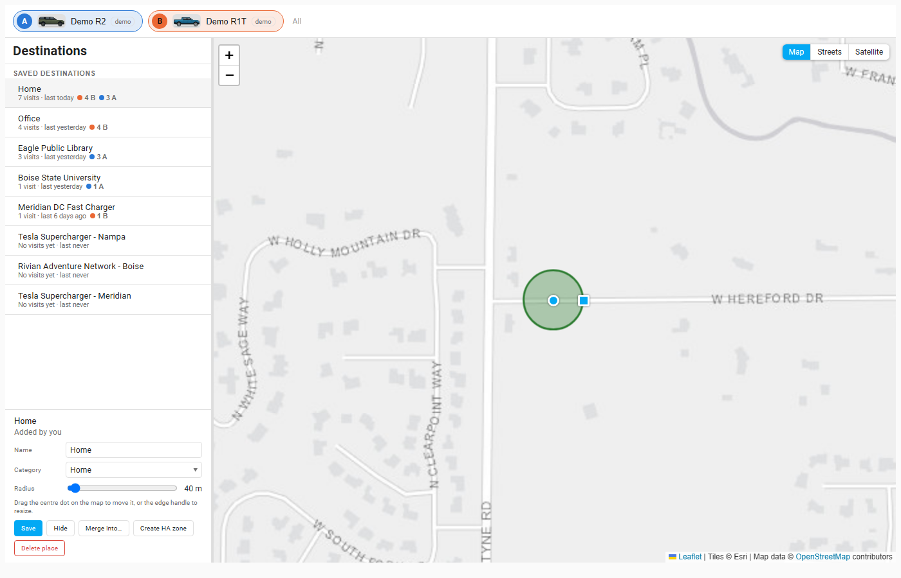
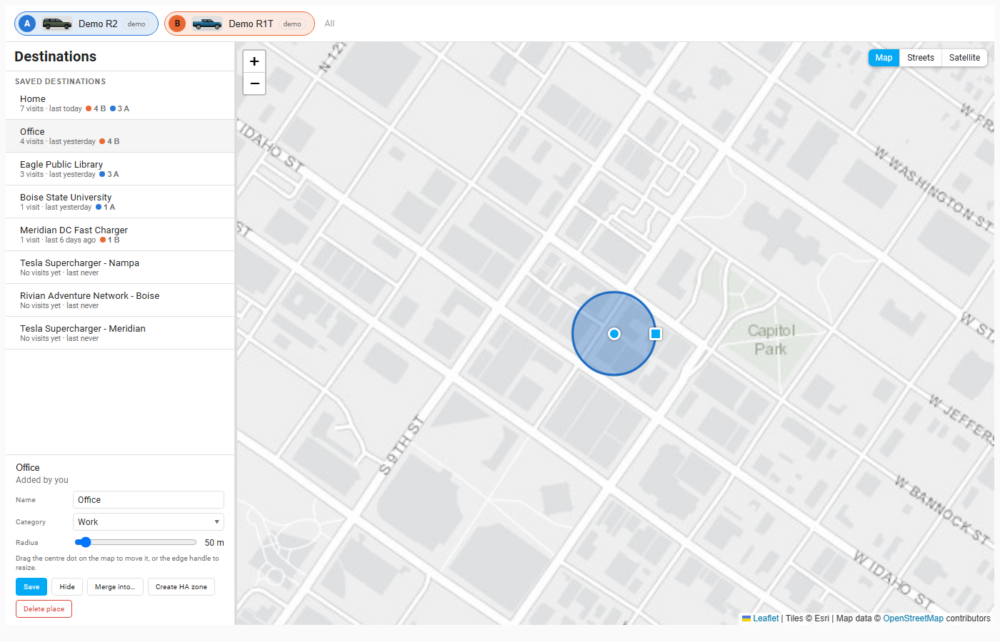

# Destinations tab

Destinations are the places you drive to and from: Home, Office, a trailhead, a charger. Naming them turns a drive into "Home → Office" everywhere, and powers [Fav Routes](fav-routes.md). Places belong to the household, not to a vehicle; visits are counted per vehicle.

## Where destinations come from

- **Home Assistant zones.** Every zone you have in Home Assistant appears automatically, and stays in sync when you change it.
- **Suggestions.** A spot where you start or stop **three or more times** within about 200 m is suggested automatically. If place naming is on (see [Options](options.md)), an unnamed suggestion is looked up once on OpenStreetMap to propose a name; otherwise it shows as "Place #N" until you name it.
- **Your own.** Name a drive's start or end on the Drives tab, which creates a place there if none exists.

Naming a suggestion turns it into one of your destinations.

## The page

- **List.** *Suggestions* (unnamed, most visited first), then *Saved destinations* (named or zone-backed), plus a collapsed *Hidden* section. Each row shows visits, last visit and a colored count per vehicle. Pick a row, or a circle on the map, to select it.
- **Map.** One circle per place, sized to its radius and colored by category (suggestions are dashed because their category is a guess). Basemap buttons are the same as on the Drives tab.

## Editing a place (administrators)

Everyone can read a place's details; administrators get the form:

- **Name** and **Category**. There are 14 categories: Home, Work, School, Shopping, Dining, Charging, Friends, Family, Gym, Swimming, Mountain biking, Park, Medical and Other. The category sets the icon and color.
- **Radius** slider (25 to 500 m), saved when you release it. You can also **drag the centre dot** on the map to move the place, or the **edge handle** to resize it.
- **Save** stores name and category.
- **Hide** removes the place from labeling (hidden places label no drives); **Unhide** from the Hidden section brings it back.
- **Merge into...** then click another place in the list or on the map, and confirm. The merged place's drives move to the target.
- **Create HA zone** makes a Home Assistant zone at this spot (so automations can use it too) and links it to the place.
- **Delete place** asks for confirmation. A place you created is deleted and its drives become unlabeled; an automatic suggestion is only hidden so it is not suggested again, and can be restored.

A place backed by a Home Assistant zone is read-only here: its location and radius come from the zone, and a link opens Settings > Areas & zones > Zones. (Zone radii are limited to 50 to 500 m.)

## How to...

**Rename a place** (administrators)
1. Select it in the list or on the map.
2. Type a new **Name**, pick a **Category**, press **Save**.

**Merge two places**
1. Select the place to remove, press **Merge into...**.
2. Click the place to keep (in the list or on the map) and confirm. Its drives move over.

**Move or resize a place**
1. Select it, then drag the centre dot on the map to move it, or the edge handle to resize (or use the radius slider).

**Create a Home Assistant zone from a place**
1. Select the place and press **Create HA zone**.
2. The zone appears in Settings > Areas & zones and the place is linked to it.

## On a phone

The map sits above the list; one finger scrolls the page and two fingers pan and zoom the map.

## Notes

- Only a place's coordinates are sent when looking up a name; see [Privacy](privacy.md).
- Force a re-detection with `rivian.rebuild_places` (see [Services](services.md)).
