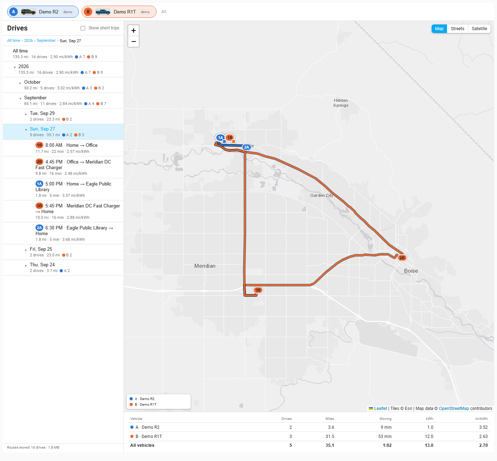
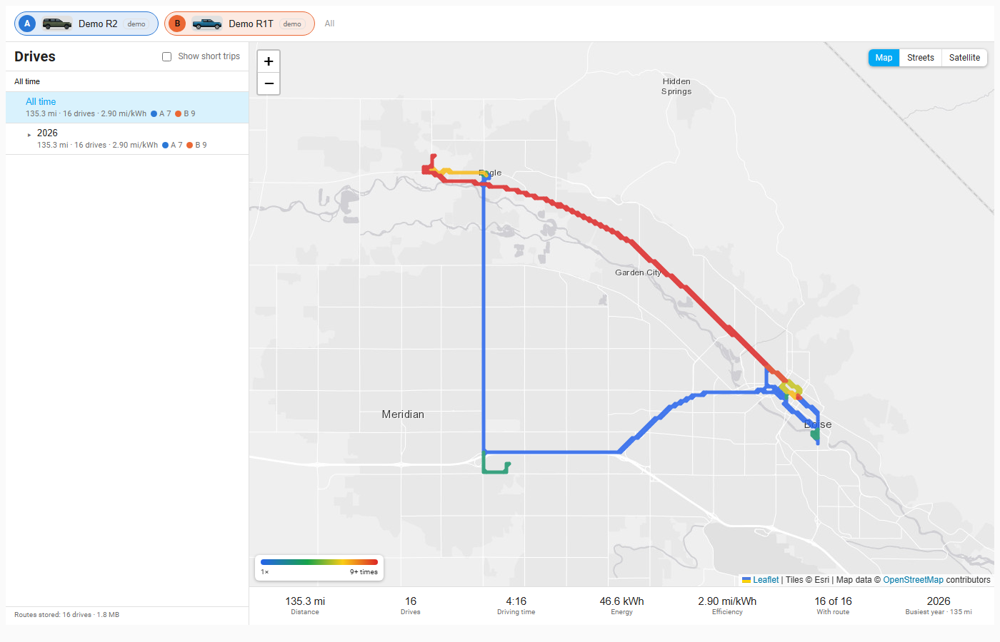
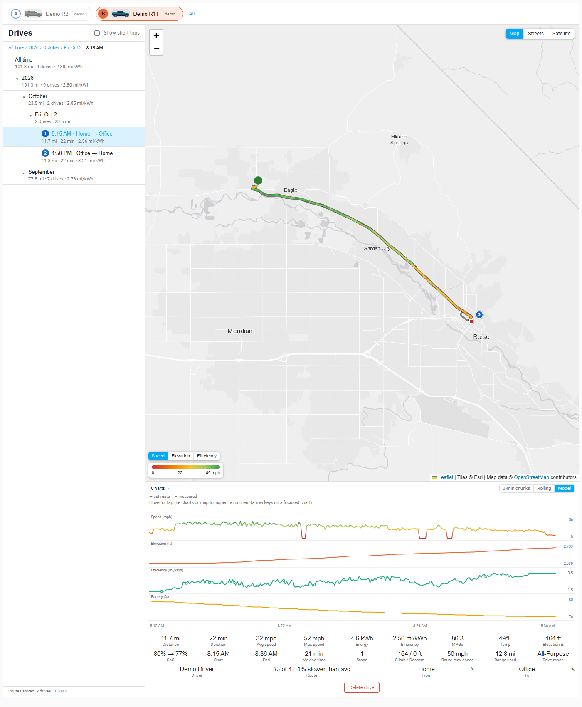
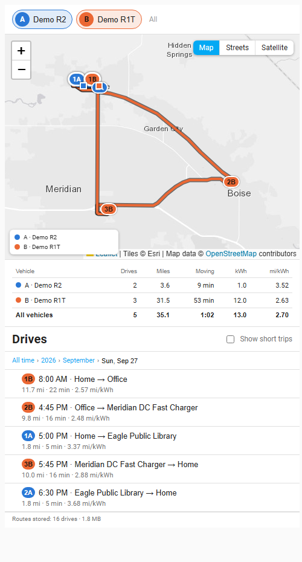

# Drives tab

The Drives tab is an explorer for every drive the integration has recorded: a calendar tree on the left (below the map on a phone) and a map with charts on the right.

## The calendar tree

Navigate **All time > year > month > day > drive**. Each row shows the number of drives, miles and mi/kWh for that period, with a small colored count per vehicle when several are selected. Only the selected path is expanded, and your position is remembered. A drive row reads like "8:15 AM · Home → Office" once its start and end match a [destination](destinations.md).

**Show short trips** (top right of the list) includes very short moves under half a mile, such as repositioning the car, which are hidden by default.

## The map

Three basemaps are available (**Map**, **Streets**, **Satellite**, top right); your choice is remembered per browser. What the map shows depends on what you select in the tree.

### All time, year or month: heat map

Roads are colored by how often you drove them; a legend shows the scale. A repeated out-and-back counts twice; parking-lot loops and long stops do not inflate counts. Totals for the period sit under the map (distance, drives, driving time, energy, efficiency, drives with a route, busiest day). Heat is kept even after old routes are pruned.

### Day: every drive of the day

Each drive is drawn on one speed-colored scale and numbered 1, 2, 3 ... in time order (also in the list). With several vehicles the number carries the vehicle's letter (1A, 2B) and the route takes the vehicle's color.

- A **green circle** marks where the day started and a **red square** where it ended (the square sits inside the green ring if you ended where you began).
- A numbered **badge** marks where each later drive starts; nearby badges merge ("4, 7").
- Click a badge or a drive in the list to open it.
- If the car was slow to report its position, the day still starts where it was parked, and the unrecorded stretch is drawn as a **dashed** line.
- Under the map a table shows drives, miles, moving time, kWh and mi/kWh per vehicle and for all vehicles.

### Drive: one drive in detail

The chosen drive is drawn on its own speed scale with its own start and end markers, over the day's other drives in gray. A **Speed | Elevation | Efficiency** switch next to the legend recolors the route.

**Charts.** Four stacked charts share one time axis: Speed, Elevation, Efficiency and Battery %. Move the pointer across any chart to see a readout; a cursor follows on all charts and a dot follows on the route (hovering the route moves the cursor too). On a day, parked time between drives is squeezed into a short squiggle, and clicking a drive's stretch on a chart selects that drive. On a touch screen, tap or drag horizontally on a chart; the cursor stays after you lift your finger, and a tap never switches drives. The **Charts** header collapses the panel, and the state is remembered.

The Efficiency chart has three views (**Model** is the default once a fit exists; your choice is remembered):

- **3-min chunks**: one step per 3-minute piece of the drive, in mi/kWh.
- **Rolling**: computed from battery and distance over the last drop of at least 0.3 % state of charge. Rivian reports charge in 0.1 % steps, so shorter windows would be jumpy.
- **Model**: an estimate from a physics model fitted to your vehicle (aerodynamics, rolling resistance, hills, speed, auxiliary load) and anchored to the measured battery steps. The line is the estimate; the dots are the measured steps. It appears once about 15 routed drives from the last 90 days exist, and refits nightly (or on demand, see [Services](services.md)).

Rolling and chunk values carry across drive boundaries, so a drive does not start blank.

**Stats tiles.** Distance, duration, average and max speed (max is a robust 99th percentile that ignores GPS spikes), energy, efficiency, MPGe, temperature, elevation change, battery start and end, start and end times, moving time, stops, climb and descent. Drives recorded live also show range used, drive mode(s), driver and trailer. A drive that belongs to a [favorite route](fav-routes.md) shows its rank ("#3 of 4 · 1% slower than avg"). **From** and **To** tiles show the places.

**Naming places.** Administrators see a pencil next to From and To: it opens a small form (name and category) to name that endpoint, or to create the place if there is none yet. You can also tap the selected drive's own start or end marker on the map.

### Delete a drive or a day (administrators)

A red **Delete drive** button sits under a drive's tiles and **Delete day** under a day's. Each asks for confirmation. Deleting also recounts the heat map, destinations, favorite routes and long-term statistics. Deleted drives cannot be recovered, except by running a backfill again.

## How to...

**Open a day and a drive**
1. Pick **All time**, then a year, month and day in the calendar tree (or the drill-down list on a phone).
2. The map shows every drive of the day, numbered in time order.
3. Click a numbered badge or a row in the list to open that drive.

**Compare chunks, rolling and model efficiency**
1. Open a drive and look at the Efficiency chart.
2. Switch between **3-min chunks**, **Rolling** and **Model** at the top right of the charts.
3. Hover the chart to read each value; the cursor follows on the other charts and the map.

**Name a place from a drive** (administrators)
1. Open a drive and find the **From** or **To** tile.
2. Click the pencil, type a name, pick a category and save.
3. Every drive that starts or ends there now reads, for example, "Home -> Office".

**Delete a drive or a day** (administrators)
1. Open the drive (or the day) and press the red **Delete drive** (or **Delete day**) button.
2. Read the confirmation and confirm. The heat map, destinations, routes and statistics are recounted.

## On a phone

- Under 700 px wide the card grows to its content and only the page scrolls. Order: map, charts and stats, then the list.
- The list becomes a drill-down: tap a row to go deeper, use the breadcrumb to go up. Selecting a row scrolls back to the top.
- **One finger scrolls the page** over the map; use **two fingers** to pan and zoom the map.

## What the numbers mean

- **mi/kWh** is miles per kilowatt-hour (higher is better). **MPGe** converts it at 33.705 kWh per gallon.
- Energy comes from the battery's state-of-charge drop and the pack capacity, so it is only as fine as Rivian's 0.1 % steps; short drives are noisy.
- Climb and descent use GPS altitude with a 4 m filter so noise does not inflate them.
- There is deliberately no regen figure: the charge level Rivian reports does not rise during regenerative braking, so it cannot be derived.
