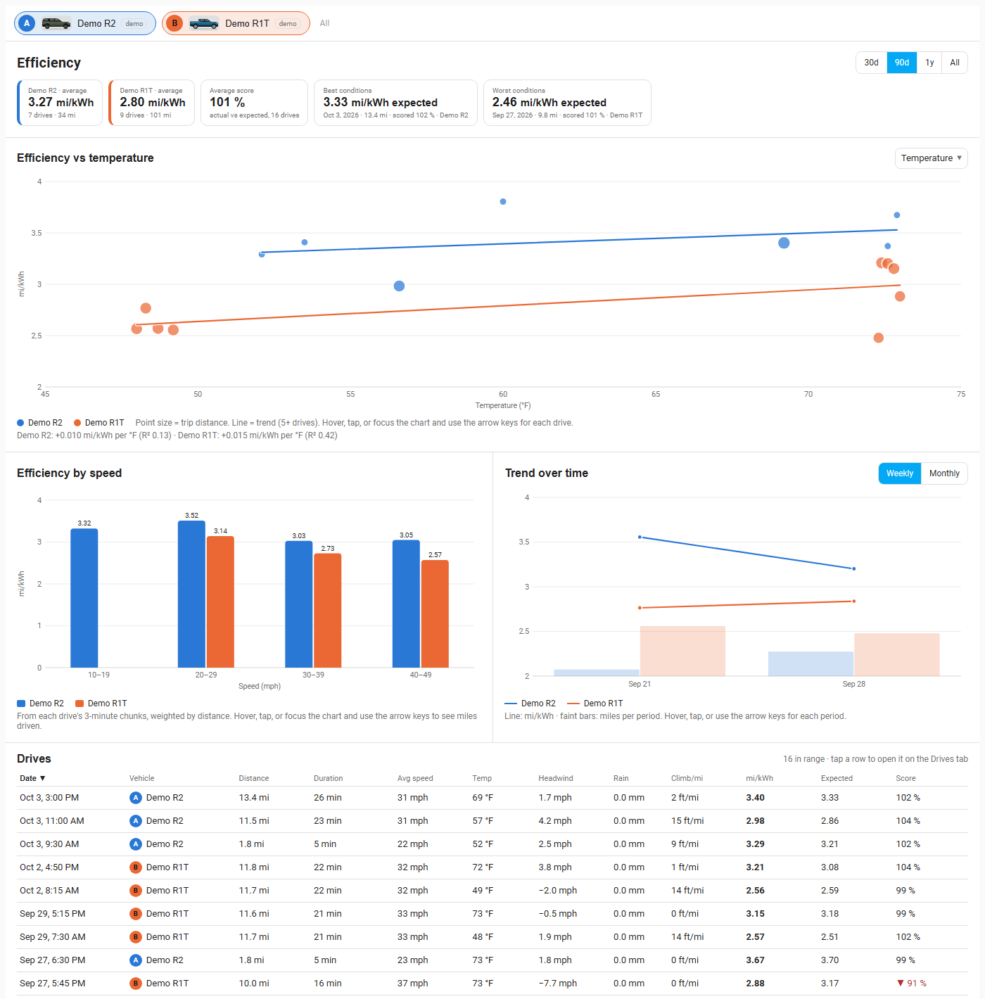

# Efficiency tab

The Efficiency tab explains **why** some drives use more energy than others: weather, wind, speed, hills and trip length. Efficiency is in **mi/kWh** (higher is better).

A range switch at the top (**30d / 90d / 1y / All**) applies to the whole page.

## Summary tiles

- One tile per vehicle: average mi/kWh, number of drives and miles.
- **Average score**: actual efficiency against what the model expected, across the drives in range.
- **Best conditions** and **Worst conditions**: the drives with the highest and lowest *expected* efficiency, with their score. They show how much the conditions, not the driving, were helping or hurting.

## Efficiency vs ...

A scatter plot with one dot per drive, colored by vehicle, with **dot size showing trip length**. Choose what to plot against with the selector at the top right:

- **Temperature**: cold costs range through battery chemistry and cabin heating.
- **Headwind**: wind along your direction of travel. Positive is a headwind, negative a tailwind.
- **Air density**: lower in warm weather and at altitude, which cuts drag.
- **Rain**: precipitation during the drive.
- **Average speed**, **Trip length** and **Climb** (net feet climbed per mile).

A **trend line** per vehicle appears once it has at least five drives, with its slope and R² underneath ("+0.010 mi/kWh per °F (R² 0.13)"). A low R² means the factor explains little on its own. Hover or tap a dot for that drive, or focus the chart and use the arrow keys to step through drives.

Weather (temperature, wind, rain, pressure, humidity) comes from the Open-Meteo archive for the drive's own route and time; see [Privacy](privacy.md). Headwind and air density are derived from it.

## Efficiency by speed

On a computer, this chart and **Trend over time** sit side by side; on a phone they stack.

Bars by speed band (10-19 mph, 20-29 mph, ...) per vehicle, built from each drive's 3-minute chunks and weighted by distance. Hover or tap a bar for the miles behind it. Highway speeds typically cost the most energy.

## Trend over time

A weekly or monthly line of mi/kWh per vehicle (switch **Weekly / Monthly**) over faint bars showing miles driven in each period. Hover, tap, or use the arrow keys to read a period.

## Drives table

Every drive in range: date, vehicle, distance, duration, average speed, temperature, headwind, rain, climb per mile, actual mi/kWh, **Expected** mi/kWh and **Score**. Click a header to sort; hover a header for what it means. **Click a row** to open that drive on the [Drives tab](drives.md).

**Score** = expected energy ÷ actual energy. 100 % means exactly as expected, above about 105 % (up arrow) is better than expected and below about 95 % (down arrow) is worse. "Expected" comes from the energy model fitted to your own drives (aerodynamics, rolling resistance, hills, regen, auxiliary load) combined with the drive's weather, so it adapts to each vehicle. It needs enough routed drives before it can score; drives without weather or a route show "–".

## How to...

**Pick what to plot against**
1. Use the selector at the top right of **Efficiency vs ...** and choose Temperature, Headwind, Air density, Rain, Average speed, Trip length or Climb.
2. Read the trend line's slope and R² under the chart.

**Read a drive's score**
1. Find the drive in the **Drives** table at the bottom.
2. Compare **mi/kWh** with **Expected**: the **Score** is expected energy divided by actual, so above 100 % beat the model.

**Open a drive from the table**
1. Click its row; the Drives tab opens on that drive.

**Change the period**
1. Use **30d / 90d / 1y / All** at the top; **Weekly / Monthly** changes the trend chart.

## Notes

- Weather for older drives is filled in once automatically after upgrading, and on demand with `rivian.backfill_weather`. Demo vehicles are skipped.
- Charts support touch: tap a point to see it, no hover needed.
