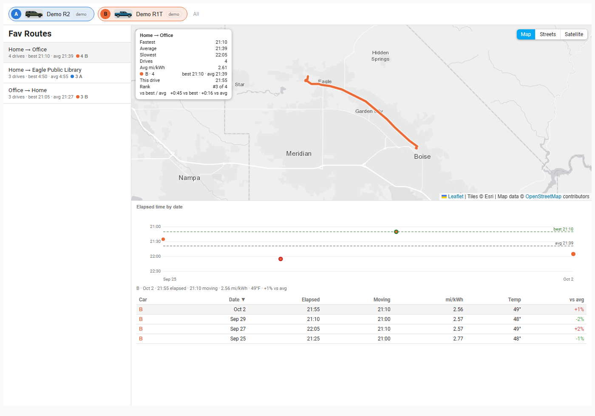

# Fav Routes tab

Fav Routes finds the trips you repeat, such as Home → Office, and lets you compare each run against your best, average and worst, like a Strava segment.

## How routes are found

A route appears once the same start place and end place (see [Destinations](destinations.md)) have been driven **at least three times**, with the start different from the end. Routes are shared across your vehicles: a drive in either car counts.

Two drives between the same places can take different roads, so each pair is split into **path variants** by comparing the roads actually driven. A second variant is named "Home → Office (via 2)". A variant needs three drives of its own; smaller ones fold into the pair's main variant. Drives without a stored GPS route still count for timing but never create a variant.

A drive that took more than three times the usual (median) time, for example one with a long errand in the middle, is flagged as an **outlier**: it stays in the list but is left out of the statistics and ranking.

## The page

- **Route list** (left, or top on a phone), sorted by drive count: "Home → Office · 15 drives · best 14:02 · avg 16:30", with a colored count per vehicle. Click a route to select it.
- **Map**: every drive of the route drawn thin gray, the fastest in green, the slowest in red, and the selected drive in blue on top, with start and end markers. A note appears if some drives have no stored route ("9 of 15 drives have a route on the map").
- **Stats overlay** on the map: Fastest, Average and Slowest elapsed time, number of drives and average mi/kWh, overall and per vehicle; and for the selected drive its time, rank ("#3 of 15") and how it compares ("+1:12 vs best · −0:40 vs avg").
- **Dot chart** "Elapsed time by date": one dot per drive (faster plots higher), with dashed lines for best and average. Hover, focus or tap a dot to read that drive; click it to select it.
- **Table** of the route's drives with vehicle, date, elapsed time, moving time, mi/kWh, temperature and a color-coded **vs avg** column (green faster, red slower). Click a column header to sort. Outliers carry a warning flag. Clicking a row or a dot selects that drive everywhere.

## How to...

**Compare a drive against your best and average**
1. Pick a route in the list.
2. Click a dot in the **Elapsed time by date** chart, or a row in the table.
3. The map overlay shows that drive's time, rank ("#3 of 15") and the difference from best and average; the **vs avg** column shows it for every drive.

**See which path was the fastest**
1. On the map, the fastest drive is green and the slowest red; the selected one is blue on top.

**Rename a route** (administrators)
1. Click the pencil on the map overlay title and type a name (empty returns to the automatic one).

## Administrators

A pencil on the overlay title renames the route (leave the name empty to return to the automatic one). Renames survive when routes are rebuilt.

## Notes

- Routes rebuild automatically after each drive and when you change places. Force it with `rivian.rebuild_routes` (see [Services](services.md)).
- The Drives tab also shows a drive's route rank in its stats tiles.
