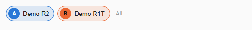

# The vehicle bar

Every tab has a bar at the top with one chip per vehicle in your household. It decides which vehicles the whole dashboard shows, so you can look at one car, or compare several on the same map and charts.

## Reading a chip

- **Letter and color.** Each vehicle gets a fixed letter (A, B, ...) and color. They are used everywhere: map routes, chart lines, numbered drive badges (drive 2 of vehicle B is "2B"), tables and legends.
- **Picture and name.** The vehicle's picture and name.
- **demo.** A small label marks [demo vehicles](getting-started.md#try-it-with-demo-vehicles).

## Choosing vehicles

- **Tap the letter dot** to show or hide that vehicle. The last visible vehicle cannot be hidden: there is always at least one in view.
- **Tap the name** to show only that vehicle.
- **All** shows every vehicle again.

Hover a chip for a hint describing these two targets.

## Remembered per user

The selection is stored per Home Assistant user, so each person in the household keeps their own view, on every device they use. All cards on the dashboard follow the same selection immediately. If Home Assistant's per-user storage is unavailable the browser remembers it locally instead.

On the [Vehicles tab](vehicles.md) the checkbox in each card's corner is the same control.

## What changes with several vehicles

- Drives: routes are colored per vehicle, and a day lists drives from all selected vehicles together.
- Fav Routes and Destinations: shared across vehicles; statistics are shown overall and per vehicle.
- Charging and Efficiency: one line or color per vehicle.
- Totals: a household strip on the Vehicles tab and an "All vehicles" row under the day map.
