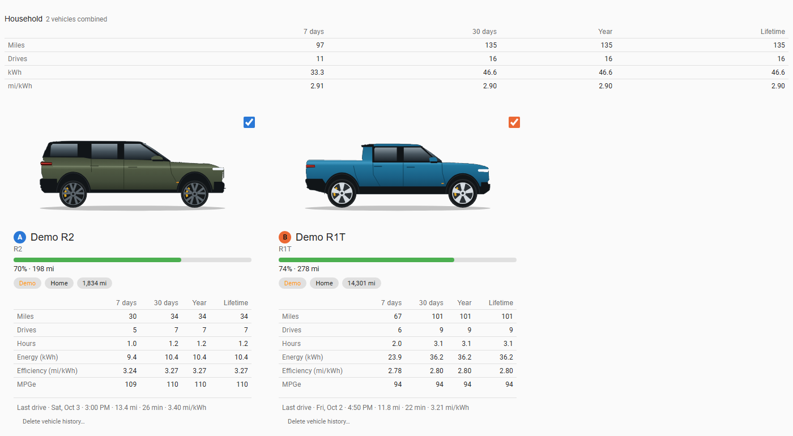

# Vehicles tab

The Vehicles tab is the household overview: one card per vehicle, plus combined totals.

## What you see

- **Household strip** (when two or more vehicles are selected): miles, drives, kWh and mi/kWh for 7 days, 30 days, the year and lifetime, summed across the selected vehicles.
- **Vehicle card**, one per vehicle:
  - the vehicle's picture, name, model and its letter badge;
  - a battery bar with state of charge and estimated range (click it to open the entity's history);
  - live **chips** such as location (for example "Home") and odometer; demo vehicles carry a **Demo** chip;
  - a table of Miles, Drives, Hours, Energy (kWh), Efficiency (mi/kWh) and MPGe for 7 days, 30 days, year and lifetime;
  - the **last drive** (time, distance, duration, efficiency). Click it to open the Drives tab.
- **Checkbox** in each card's corner: includes or excludes the vehicle from the dashboard's [vehicle selection](vehicle-bar.md).

On a wide screen cards sit side by side and scroll horizontally if there are many; on a phone they stack.

## Vehicle pictures

Pictures for real vehicles come from a rivian.com configurator render, looked up the first time a vehicle is seen and then stored locally. They can occasionally show the wrong wheels or trim. The [demo vehicles](getting-started.md#try-it-with-demo-vehicles) use two flat side-view illustrations of an R2 and an R1T that ship with the integration (no photos, logos or wordmarks). Replace one with any image using `rivian.set_vehicle_picture` (see [Services](services.md)).

## Delete vehicle history (administrators)

A subtle **Delete vehicle history...** link at the bottom of a card removes all stored drives, routes, charging sessions and statistics for that vehicle. Because it cannot be undone you must **type the vehicle's name** to confirm. A real vehicle keeps recording new drives afterwards; a demo vehicle is removed completely.

## How to...

**Choose which vehicles the dashboard shows**
1. Tick or untick the checkbox in a card's corner (or use the [vehicle bar](vehicle-bar.md)).
2. The household strip and every other tab follow the selection.

**Open a vehicle's last drive**
1. Click the "Last drive" line in its card.

**Delete a vehicle's history** (administrators)
1. Click **Delete vehicle history...** at the bottom of its card.
2. Type the vehicle's name to confirm. A real vehicle keeps recording afterwards.

## Notes

- The tables are built from the stored drives, so they start empty on a fresh install until drives are recorded (or [backfilled](getting-started.md#optional-backfill-past-drives)).
