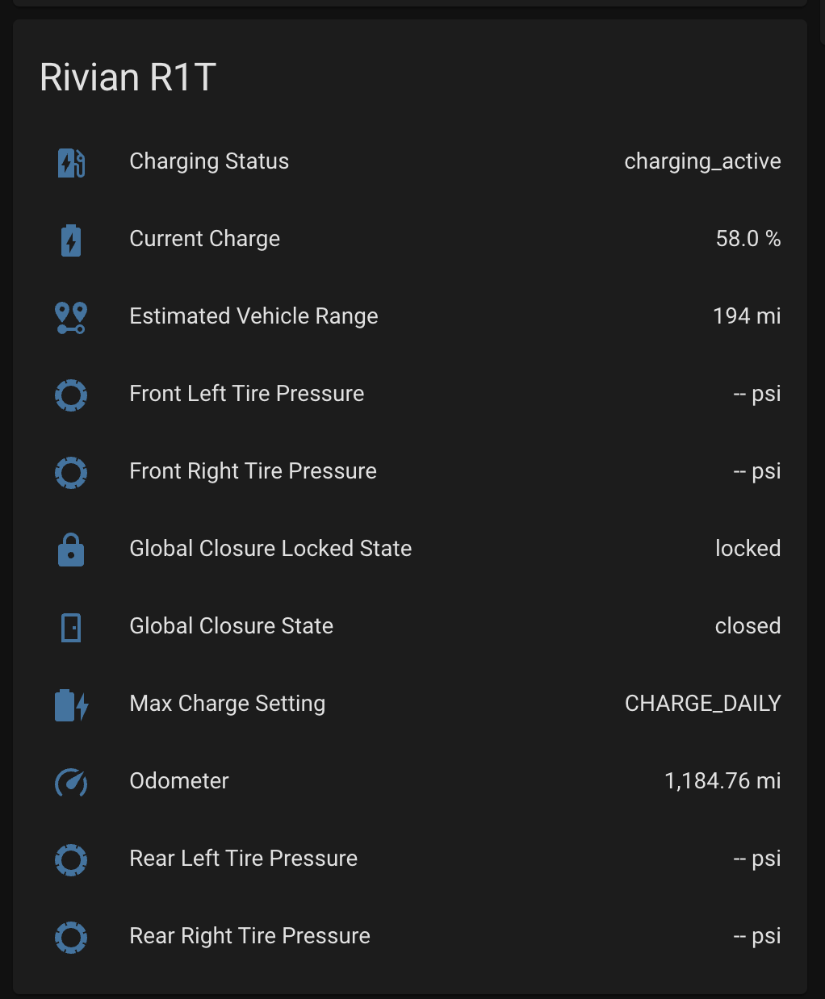



This integration is a pre-release version.
It may contain bugs or break functionality in addition to adding new features and fixes. Please review open issues and submit new ones to the [GitHub issue tracker](https://github.com/bretterer/home-assistant-rivian/issues).



# Home Assistant integration for Rivian (Unofficial)
[![GitHub Release][releases-shield]][releases]
![GitHub all releases][download-all]
![GitHub release (latest by SemVer)][download-latest]
[![GitHub Activity][commits-shield]][commits]

An unofficial Rivian integration for Home Assistant, installed through [HACS](https://hacs.xyz/docs/setup/download).

To use this extension, you'll need the following information
 - Rivian Username
 - Rivian Password
 - VIN

Your vehicle must be in delivered status and possession for this integration to function.

# Disclaimer
This [Home Assistant](https://www.home-assistant.io/) integration is not affiliated, associated, nor sponsored by Rivian Automotive, Inc.

Any use of this integration is at the sole discretion and risk of the Rivian vehicle owner integrating it into their Home Assistant installation. This owner takes full responsibility for protecting their local Home Assistant installation.

This integration is provided out of love and passion towards the Rivian ownership community. It focuses on building insights and awareness into the state of one's vehicle for use by the owner and the owner alone.

This integration will not share user or vehicle data outside Home Assistant, a single-user environment hosted and running within an owner's private network and hardware systems.



## Installation

1. Click install.
2. Reboot Home Assistant.
3. Hard refresh browser cache.
4. [![Add Integration][add-integration-badge]][add-integration] or in the HA UI go to "Configuration" -> "Integrations" click "+" and search for "Rivian (Unofficial) Integration".



## Configuration

To connect your newly installed integration to pull available sensor data (see the below example) for your Rivian vehicle, you should follow the following configuration recommendations. Not doing so could put your main Rivian account at risk of being locked and available.

* One Time Password (**recommended**) - It is best security practice always to enable One Time Password / Multi-Factor Authentication. This way, your credentials (username + password) can not be used without your explicit consent through the personal device configured on your Rivian account.
* No Account Reuse* (**recommended**) - Another best security practice is not to reuse accounts or credentials across different integrations (e.g., sharing credentials between HA and your everyday account). We highly recommend the owner *invite a new driver*, for example, `user+<purpose>@domain.com`, and use only this profile for configuration within HA.

The configuration flow is as follows:

1. **Username and Password (required)**
   - For the integration to work, we require a username and password to a Rivian account with an active *driver profile* for the vehicle you wish to monitor remotely. 
2. **OTP/MFA (optional)**
   - If OTP is enabled on the account provided, you will receive a text from Rivian with a one-time use passcode entered at this step.
3. Vehicle VIN (required)
   - Type the interested vehicle's identification number (VIN) as found on the [Rivian Account website](https://rivian.com/account/home)
   - We only poll for a single vehicle's sensor data; track https://github.com/bretterer/home-assistant-rivian/issues/20 for multiple VIN support to come later.

*Developers and Maintainers of this project take no personal responsibility for misconfiguration or misuse of the code provided by this integration. Account security is entirely the sole responsibility of the owner configuring this integration. Accounts may become locked/quarantined due to this unofficial integration.

[commits-shield]: https://img.shields.io/github/commit-activity/w/bretterer/home-assistant-rivian?style=flat-square
[commits]: https://github.com/bretterer/home-assistant-rivian/commits/main
[releases-shield]: https://img.shields.io/github/release/bretterer/home-assistant-rivian.svg?style=flat-square
[releases]: https://github.com/bretterer/home-assistant-rivian/releases
[download-all]: https://img.shields.io/github/downloads/bretterer/home-assistant-rivian/total?style=flat-square
[download-latest]: https://img.shields.io/github/downloads/bretterer/home-assistant-rivian/latest/total?style=flat-square
[add-integration]: https://my.home-assistant.io/redirect/config_flow_start?domain=rivian
[add-integration-badge]: https://my.home-assistant.io/badges/config_flow_start.svg
[rivian-discord]: https://discord.gg/jEc5RUPd
